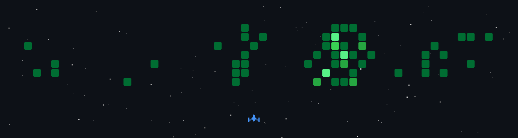

<!-- 
 -->

<!--  -->

<!-- 

  <a href="https://yourwebsite.com/">Personal Website</a> •
  <a href="https://twitter.com/yourhandle">Thread</a> •
  <a href="https://linkedin.com/in/yourhandle">LinkedIn</a> •
  <a href="https://medium.com/@yourhandle">Medium</a>

 -->

## Hi there 👋

<!--
**jayzen33/jayzen33** is a ✨ _special_ ✨ repository because its `README.md` (this file) appears on your GitHub profile.

Here are some ideas to get you started:

- 🔭 I’m currently working on ...
- 🌱 I’m currently learning ...
- 👯 I’m looking to collaborate on ...
- 🤔 I’m looking for help with ...
- 💬 Ask me about ...
- 📫 How to reach me: ...
- 😄 Pronouns: ...
- ⚡ Fun fact: ...
-->

- 🔭 I’m currently working on speech synthesis (TTS) for game scenarios, focusing on controllable emotional TTS, audio-visual joint generation, and MIDI-based singing voice synthesis.
- 🌱 I’m currently learning multi-modal large language models, reinforcement learning for generation tasks (DPO/GRPO), advanced speech tokenization techniques, and exploring AI Agents for daily life integration.
- 👯 I’m looking to collaborate on projects related to speech/audio generation, multi-modal AI, and creative applications of AIGC in gaming or entertainment.
- 🤔 I’m looking for help with efficient data cleaning pipelines, scaling up model training, and exploring novel evaluation metrics for generative models.
- 💬 Ask me about speech synthesis, controllable TTS, audio-visual generation, AI Agents or anything related to AI and technology.
- 📫 How to reach me: jayzen33@outlook.com
- 😄 Pronouns: He/Him
<!-- - ⚡ Fun fact: I once used AI to generate a game character's voice and background music in just one day — it saved the team a week of manual work! -->

<!--START_SECTION:space-shooter-->

<!--END_SECTION:space-shooter-->
